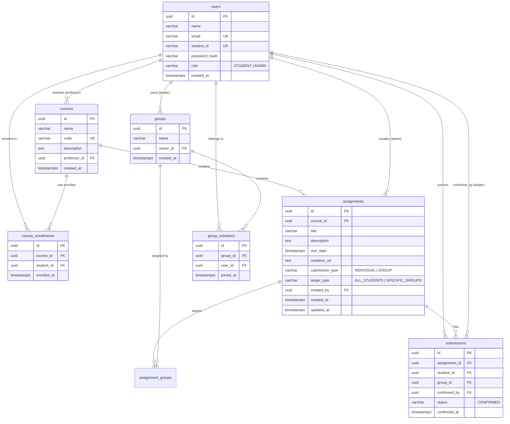

# EduFlow — Student, Group & Assignment Management System

> **Candidate**: Harsh  
> **Task**: Full Stack Intern Technical Assessment for **Joineazy** (Version 3.0 — Task 2 Courses & UI/UX Edition)  
> **Repository**: [`Harsh9945/Assignment-Management`](https://github.com/Harsh9945/Assignment-Management)  
> *Target Stack: React 18 + Tailwind CSS · Node.js 20 + Express · PostgreSQL 16 · Docker Compose*

---

## 1. Project Overview & Objective

**EduFlow** is a full-stack, role-based academic management system designed and built specifically for the **Joineazy Technical Task (Task 2)**. It streamlines student collaboration, course-level enrollment, audience-targeted coursework tracking, and external coursework submissions while enforcing strict server-side role boundaries between **Students** and **Instructors (Professors / Admins)**.

Key Task 2 extensions:
- **Course-Based Structuring**: Introduces a native `courses` entity linking students and assignments to specific courses. Students navigate a responsive course grid, and professors manage taught courses.
- **Submission Types (Individual vs Group)**: Assignments specify a `submission_type` (`INDIVIDUAL` or `GROUP`).
- **Leader Confirmation Fan-Out**: For `GROUP` assignments, only the group leader can acknowledge submission. In an atomic DB transaction, confirmation is automatically reflected across all active group members with explicit `confirmed_by` attribution.
- **UI/UX Micro-Animations & Feedback**: Smooth progress bar fill transitions, checkmark micro-animations on 100% completion, inline form feedback, and loading skeletons.
- **Professor Analytics**: Real-time course completion percentages, student enrollment breakdown, and status query filtering (`?status=CONFIRMED|PENDING`).

---

## 2. Feature Matrix by Role

| Feature Area | Student Capabilities | Instructor / Professor Capabilities |
| :--- | :--- | :--- |
| **Authentication** | Register with validation & inline feedback. Login with email or student ID. Dynamic role redirection. | Login with credentials. Automatic redirection to `/admin/dashboard`. |
| **Course Navigation** | View enrolled courses grid. Clickable course cards with assignment count & instructor details. | View taught courses, student counts, and overall course completion metrics. Create new courses. |
| **Student Enrollment** | View coursework scoped strictly to enrolled courses (403 guard on unauthorized courses). | Enroll students into courses by email or student ID. |
| **Group Management** | Create group (owner + leader). Search students & direct-add members. | View group breakdowns per assignment and course. |
| **Assignments & Submissions** | View `INDIVIDUAL` or `GROUP` badges. On group assignments, only group leader can acknowledge. Non-leaders see informative disabled states. | Create assignments specifying `course_id`, `submission_type`, `target_type`, `due_date`, and `onedrive_url`. |
| **Progress & Micro-animations** | Animated progress bar transitions, green checkmark completion badges, and `confirmed_by` attribution. | Monitor submission progress per student & group, filter by status (`CONFIRMED` / `PENDING`), and view Recharts analytics. |

---

## 3. Database Schema & ER Diagram

### Relational Schema Definition (v3.0)



---

## 4. API Specification & Endpoints

Base URL: `/api` · Formats: `application/json` · Authorization: `Bearer <JWT>`

### 4.1 Courses (`/api/courses`)
| Method | Endpoint | Role | Description |
| :--- | :--- | :--- | :--- |
| `GET` | `/api/courses` | Authenticated | List caller's courses (Taught for admin, Enrolled for student). |
| `POST` | `/api/courses` | Admin | Create a new course (`name`, `code`, `description`). |
| `GET` | `/api/courses/:id` | Authenticated | Fetch course details (403 for non-enrolled students). |
| `POST` | `/api/courses/:id/enroll` | Admin | Enroll student into course by email or student ID. |
| `GET` | `/api/courses/:id/assignments` | Authenticated | Fetch assignments scoped to the course. |
| `GET` | `/api/courses/:id/analytics` | Admin | Course-level analytics (student count, total assignments, completion %). |

### 4.2 Assignments (`/api/assignments`)
| Method | Endpoint | Role | Description |
| :--- | :--- | :--- | :--- |
| `POST` | `/api/assignments` | Admin | Create assignment (`courseId`, `title`, `description`, `dueDate`, `onedriveUrl`, `submissionType`, `targetType`). |
| `GET` | `/api/assignments` | Authenticated | List assignments applicable to caller. |
| `POST` | `/api/assignments/:id/confirm-submission` | Student | Confirm submission. For `GROUP` assignments, must be group leader; fan-out updates all group members. |
| `GET` | `/api/assignments/:id/my-submission` | Student | Fetch submission status and `confirmedBy` leader details. |

### 4.3 Admin Progress & Analytics (`/api/admin`)
| Method | Endpoint | Role | Description |
| :--- | :--- | :--- | :--- |
| `GET` | `/api/admin/dashboard/summary` | Admin | Dashboard KPIs and Recharts bar chart data. |
| `GET` | `/api/admin/assignments/:id/progress`| Admin | Progress breakdown supporting optional `?status=CONFIRMED|PENDING` filter. |

---

## 5. Setup & Execution Instructions

### Method 1: Local Setup & Testing (Task 2)
```bash
cd backend
npm install
npm run migrate   # Applies 002_courses.sql migration
npm run seed:v3   # Populates Task 2 demo data (courses, enrollments, groups)
npm test          # Runs 7 test suites including courses & group fan-out tests
npm run dev       # Starts Express API server on http://localhost:5000
```

```bash
cd ../frontend
npm install
npm run dev       # Starts Vite React dev server on http://localhost:3000
```

### Method 2: Docker Compose
```bash
docker-compose up --build -d
```

---

## 6. Seed Demo Accounts (Task 2)

| Account Role | Email Identifier | Password | Context |
| :--- | :--- | :--- | :--- |
| **Professor (Admin)** | `prof.sharma@eduflow.edu` | `admin123` | Prof. Rajesh Sharma — Teaches CS101 & SE302, manages course enrollments. |
| **Student (Leader)** | `aarav@eduflow.edu` | `student123` | Aarav Sharma (2024CS01) — Owner/Leader of Alpha Squad. Can acknowledge group submissions. |
| **Student (Member)** | `priya@eduflow.edu` | `student123` | Priya Patel (2024CS02) — Member of Alpha Squad. Receives auto-confirmed status when Aarav submits. |
| **Student (Member)** | `rohan@eduflow.edu` | `student123` | Rohan Verma (2024CS03) — Member of Alpha Squad. |
| **Student (Member)** | `ananya@eduflow.edu` | `student123` | Ananya Iyer (2024CS04) — Member of Alpha Squad. |

---

## 7. Key Design Decisions (Task 2)

- **D-9: Course Eligibility Isolation**: Assignments are bound to courses. A student can only view and confirm assignments for courses in which they are explicitly enrolled via `course_enrollments`. Server guards return `403 Forbidden` for non-enrolled direct access attempts.
- **D-10: Atomic Group Leader Fan-Out**: When a group leader confirms a `GROUP` assignment, an Express PostgreSQL transaction (`BEGIN ... COMMIT`) updates/creates submission rows for all current active members in the leader's group with `confirmed_by = leaderId`. Non-leader members attempting direct confirmation receive `403 Forbidden`.
- **D-11: UI Micro-Animations**: Progress bars use CSS hardware-accelerated width transitions (`duration-700 ease-in-out`), and 100% completion triggers a checkmark bounce animation for enhanced visual engagement.
- **D-12: Unassigned Student Safeguard**: If a student is not in any group when viewing a `GROUP` assignment, the UI displays a clear warning banner directing them to group setup before confirmation can proceed.

---

## 8. Known Limitations & Deployment Note

- **Live Database Deployment**: Due to hosting resource limits for persistent PostgreSQL instances during final build, the deployed frontend preview operates with local Docker/Node environment database connectivity or mock API fixtures as documented in setup instructions.
- **Group Dissolution**: Ownership transfer and group dissolution workflows are deferred beyond MVP scope.

---

## 9. License

This project is licensed under the terms of the [MIT License](LICENSE).
