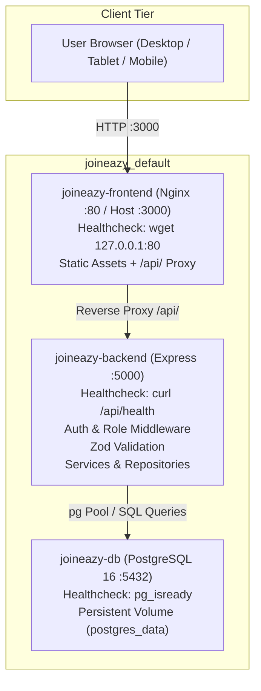
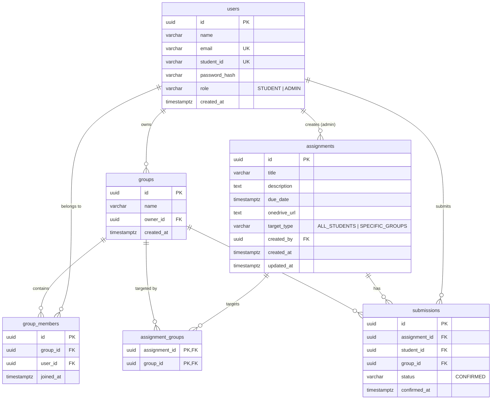

# Joineazy — Student, Group & Assignment Management System

**Version 2.0 — MVP-Scoped Edition**  
*Target Stack: React.js (Vite) + Tailwind CSS · Node.js + Express · PostgreSQL 16 · Docker Compose*

---

## 1. Project Overview & Objective

Joineazy is a full-stack, role-based academic management system designed to streamline student collaboration, assignment tracking, and external coursework submissions. It enforces strict server-side role boundaries between **Students** and **Instructors (Admins)**.

Key problems solved:
- **Group Isolation & Collaboration**: Enforces a strict one-active-group-per-student invariant while allowing group owners to search and direct-add peers without cumbersome multi-state invitations (Decision D-1).
- **Audience-Targeted Coursework**: Allows instructors to broadcast assignments to the entire student cohort (`ALL_STUDENTS`) or restrict assignments to designated student groups (`SPECIFIC_GROUPS`).
- **External Submission Verification**: Bridges external file uploads (OneDrive / SharePoint) with an explicit, idempotent two-step confirmation workflow (`"Yes, I have submitted"` → `"Confirm Submission"`).
- **Server-Side Progress Tracking**: Computes real-time group-level progress `(C / E) * 100` and professor analytics from persisted database state, preventing stale or tampered client calculations.

---

## 2. Feature Matrix by Role

| Feature Area | Student Capabilities | Instructor / Admin Capabilities |
| :--- | :--- | :--- |
| **Authentication** | Register with name, email, student ID, password. Login with email or student ID. | Login with credentials. Dedicated admin privileges. |
| **Group Management** | Create group (becomes owner + member). Search students by email/ID. Direct-add members (owner only). Remove members (owner only). | View all groups and their membership rosters. |
| **Assignments** | View only targeted assignments (All Students or their Group). View due dates with visual **Past Due** flags. | Full CRUD on assignments: title, description, due date, OneDrive URL, target scope (`ALL_STUDENTS` vs `SPECIFIC_GROUPS`). |
| **Submissions** | Open external OneDrive link with `rel="noopener noreferrer"`. Two-step confirmation modal. Idempotent re-confirmation. | Real-time monitoring of all submissions across cohorts. |
| **Progress & Analytics** | Real-time group progress bar `(C / E confirmed)` with 100% "Completed" badge. Independent personal status. | Summary KPI cards (total students, groups, assignments, overall %). Interactive Recharts bar chart. Group & student breakdown tables. |

---

## 3. Technology Stack & Architecture

### Stack Components
- **Frontend**: React 18, Vite, Tailwind CSS, Lucide React, Recharts (responsive analytics), Axios with JWT request interceptors, React Router v6.
- **Backend**: Node.js (Active LTS `node:20-alpine`), Express.js layered architecture (`Routes -> Middleware -> Controllers -> Services -> Repositories -> PostgreSQL`).
- **Data & Security**: PostgreSQL 16, `pg` connection pooling with parameterized queries, `bcryptjs` password hashing (10 rounds), `jsonwebtoken` (24h expiry), `zod` declarative schema validation.
- **Containerization**: Multi-container Docker Compose setup (`db`, `backend`, `frontend` via Nginx reverse proxy) with active healthchecks on all 3 services.

### Architecture Flow



---

## 4. Database Schema & ER Diagram

### Entity-Relationship Overview

```
users (Students & Admins)
  │
  ├──< group_members >── groups (Student Groups)
  │                         │
  │                         └──< assignment_groups >── assignments
  │                                                        │
  └──────────────────< submissions >───────────────────────┘
```

### Relational Schema Definition



### Key Database Integrity Constraints
- `users.email` and `users.student_id` are strictly `UNIQUE`.
- `group_members(group_id, user_id)` has a composite `UNIQUE` constraint to prevent duplicate memberships.
- `submissions(assignment_id, student_id)` has a composite `UNIQUE` constraint ensuring confirmation idempotency.
- Foreign keys enforce cascade deletions for group members and assignment targeting associations.

---

## 5. API Specification & Endpoints

Base URL: `/api` · Formats: `application/json` · Authorization: `Bearer <JWT>`

### 5.1 Authentication (`/api/auth`)
| Method | Endpoint | Role | Description |
| :--- | :--- | :--- | :--- |
| `POST` | `/api/auth/register` | Public | Register a student (`name`, `email`, `studentId`, `password`). Returns user and JWT. |
| `POST` | `/api/auth/login` | Public | Authenticate with email or student ID + password. Returns user and JWT. |
| `GET` | `/api/auth/me` | Authenticated | Fetch caller's profile and active group details. |

### 5.2 Groups (`/api/groups`)
| Method | Endpoint | Role | Description |
| :--- | :--- | :--- | :--- |
| `POST` | `/api/groups` | Student | Create a new group (creator becomes owner and member). Rejects if already in a group. |
| `GET` | `/api/groups/me` | Student | Fetch caller's current group, owner metadata, and member list. |
| `POST` | `/api/groups/:id/members` | Owner | Direct-add student by email or student ID. Enforces 1-group invariant. |
| `DELETE` | `/api/groups/:id/members/:userId`| Owner | Remove a member from the group (owner cannot remove themselves). |
| `GET` | `/api/groups/:id/progress` | Authenticated | Calculate confirmed/eligible count and percentage for a given assignment. |

### 5.3 Student Search (`/api/students`)
| Method | Endpoint | Role | Description |
| :--- | :--- | :--- | :--- |
| `GET` | `/api/students/search?q=` | Authenticated | Search registered students by partial email or student ID (max 20 results). |

### 5.4 Assignments (`/api/assignments`)
| Method | Endpoint | Role | Description |
| :--- | :--- | :--- | :--- |
| `POST` | `/api/assignments` | Admin | Create assignment (`title`, `description`, `dueDate`, `onedriveUrl`, `targetType`, `groupIds`). |
| `GET` | `/api/assignments` | Authenticated | List assignments applicable to caller (filtered by student group or all for admin). |
| `GET` | `/api/assignments/:id` | Authenticated | Detailed assignment view (server re-checks eligibility for students). |
| `PATCH` | `/api/assignments/:id` | Admin | Edit assignment details and re-sync target groups. |
| `POST` | `/api/assignments/:id/confirm-submission` | Student | Persist submission confirmation idempotently. |
| `GET` | `/api/assignments/:id/my-submission` | Student | Check caller's personal submission status (`CONFIRMED` vs `PENDING`). |

### 5.5 Admin Analytics (`/api/admin`)
| Method | Endpoint | Role | Description |
| :--- | :--- | :--- | :--- |
| `GET` | `/api/admin/dashboard/summary` | Admin | Totals (students, groups, assignments, overall %) and Recharts data. |
| `GET` | `/api/admin/assignments/:id/progress`| Admin | Group-wise and student-wise confirmation breakdown with timestamps. |
| `GET` | `/api/admin/groups` | Admin | List all existing groups for assignment targeting UI dropdowns. |

---

## 6. Progress Calculation Formula

For group **$G$** and assignment **$A$**:
- Let $E$ = total number of active enrolled members in group $G$.
- Let $C$ = number of members in $E$ with a confirmed submission for assignment $A$.

$$\text{Group Progress} = \begin{cases} \left(\dfrac{C}{E}\right) \times 100\% & \text{if } E > 0 \\ \text{N/A} & \text{if } E = 0 \end{cases}$$

### Progress States
- **0%**: None confirmed.
- **1% – 99%**: Partial completion with visual progress bar.
- **100%**: Complete — triggers the green `✓ Completed` badge.
- **Student Independence**: A student's individual confirmation status (`CONFIRMED` vs `PENDING`) is always rendered independently of the group's aggregate percentage.
- **Zero Client Trust**: All figures are computed server-side from the PostgreSQL `submissions` table.

---

## 7. Setup & Execution Instructions

### Prerequisites
- [Docker Desktop](https://www.docker.com/) (running) & Docker Compose
- *Or for local development*: Node.js 20+ and PostgreSQL 16+

### Method 1: One-Command Docker Setup (Recommended)

1. Clone and navigate to the repository directory:
   ```bash
   git clone https://github.com/Harsh9945/Assignment-Management.git
   cd Assignment-Management
   ```
2. Copy environment file:
   ```bash
   cp .env.example .env
   ```
3. Build and launch all containers:
   ```bash
   docker-compose up --build -d
   ```
4. Verify container health:
   ```bash
   docker-compose ps
   ```
   *Expected output: all 3 services (`joineazy-db`, `joineazy-backend`, `joineazy-frontend`) show `(healthy)`.*
5. Access the applications:
   - **Frontend Web UI**: [http://localhost:3000](http://localhost:3000)
   - **Backend API**: [http://localhost:5000/api/health](http://localhost:5000/api/health)
   - **PostgreSQL**: `localhost:5432`

---

### Method 2: Manual Local Development

#### 1. Start PostgreSQL
Ensure PostgreSQL is running locally on port 5432 with a database named `joineazy`.

#### 2. Backend Setup
```bash
cd backend
npm install
npm run migrate   # Applies database schema
npm run seed      # Populates demo accounts and test data
npm run dev       # Starts Express API server on http://localhost:5000
```

#### 3. Frontend Setup
```bash
cd ../frontend
npm install
npm run dev       # Starts Vite development server on http://localhost:3000
```

---

## 8. Automated Testing & Verification

The test suite consists of **4 dedicated test suites** with **40 automated tests** covering validation edge cases, authorization boundaries, group rules, and the complete Section 13.2 acceptance scenario:

```bash
cd backend
npm test
```

### Test Suite Breakdown

1. **`tests/auth.test.js`** (10 tests):
   - Valid student registration and bcrypt password hashing verification.
   - **Validation failures**: Rejection of duplicate email (FR-01.2, `409 Conflict`), duplicate student ID (FR-01.2, `409 Conflict`), invalid email formats, and password lengths < 6 characters (Zod `400 Bad Request`).
   - Authentication via email or student ID.
   - Rejection on wrong password (`401`), non-existent account (`401`), missing token (`401`), and malformed JWT token (`401`).
2. **`tests/groups.test.js`** (10 tests):
   - Group creation with creator set as owner and first member (FR-02.1, FR-02.2).
   - **Validation failures**: Rejection of second group creation by an already grouped student (FR-02.3, `400 Bad Request`).
   - Student search by email and student ID (FR-03.1).
   - Direct-add member (FR-03.2).
   - **Validation failures**: Duplicate addition to the same group (FR-03.3, `400`), and adding a student who is already in another active group (FR-03.3, `400`).
   - **Authorization checks**: Non-owners rejected from adding or removing members (FR-03.5, `403 Forbidden`).
   - Owner cannot remove themselves (`400`); owner removes member (`200`, preserving account).
3. **`tests/assignments.test.js`** (11 tests):
   - **Validation failures (FR-04.4)**: Rejection of malformed/invalid OneDrive URLs (`400`), malformed due dates (`400`), and empty `groupIds` array when `targetType === 'SPECIFIC_GROUPS'` (`400`).
   - **Authorization checks (FR-01.7)**: Student rejected from creating an assignment (`403 Forbidden`).
   - Targeting logic: Creation of `ALL_STUDENTS` vs `SPECIFIC_GROUPS` assignments.
   - Visibility filtering (FR-05.1): Group A student sees Group A assignment; Group B student does NOT see Group A assignment.
   - Unauthorized direct GET attempt by ineligible student rejected (`403 Forbidden`).
   - **Server-side eligibility check on submission (FR-06.4)**: Ineligible student attempting to POST `/api/assignments/:id/confirm-submission` directly is rejected with `403 Forbidden`.
   - Admin assignment modification (FR-04.2) verified without record duplication.
4. **`tests/acceptance.test.js`** (9 tests — SRS Section 13.2):
   - 4 students (`S1`–`S4`) + 1 admin registered.
   - S1 creates group and direct-adds S2, S3, S4.
   - Admin creates assignment targeted to that group.
   - S1, S2, S3 confirm submissions; S4 remains pending.
   - Verified professor dashboard shows **3/4 = 75%** for that group.
   - Verified S1, S2, S3 each see **75%** group figure and **Confirmed** status.
   - Verified S4 sees group at **75%** but own status as **Pending**.
   - Verified **idempotency**: S1 re-confirms without altering count or duplicating rows.
   - Verified student cannot access admin progress endpoint (`403 Forbidden`).

---

## 9. Seed Demo Accounts

The database comes pre-seeded with accounts to easily demonstrate all flows:

| Account Role | Email Identifier | Student ID | Password | Context |
| :--- | :--- | :--- | :--- | :--- |
| **Admin (Professor)** | `prof@joineazy.edu` | *N/A* | `admin123` | Full access to professor dashboard, assignment creation, and cohort analytics. |
| **Student 1** | `student1@joineazy.edu` | `STU-001` | `student123` | Owner of "Alpha Squad", has confirmed submission on Final Capstone. |
| **Student 2** | `student2@joineazy.edu` | `STU-002` | `student123` | Member of "Alpha Squad", has confirmed submission on Final Capstone. |
| **Student 3** | `student3@joineazy.edu` | `STU-003` | `student123` | Member of "Alpha Squad", has confirmed submission on Final Capstone. |
| **Student 4** | `student4@joineazy.edu` | `STU-004` | `student123` | Member of "Alpha Squad", **Pending** submission on Final Capstone. |

*Quick login buttons are also provided directly on the Login page for 1-click credential population.*

---

## 10. Key Design Decisions & Rationale

- **D-1: Direct-Add Membership**: Rather than introducing a complex invite/accept/reject state machine, group owners search and add peers directly. This satisfies the requirement, eliminates state synchronization bugs, and provides a snappy user experience.
- **D-2: Normalized Join Tables**: `group_members` and `assignment_groups` separate many-to-many relationships cleanly without duplicating core entities.
- **D-3: Idempotent Submissions**: `UNIQUE(assignment_id, student_id)` on `submissions` ensures re-submitting is an idempotent database update rather than an error or duplicated record.
- **D-4: Server-Side Progress Calculation**: Progress percentages are computed on the server from raw database rows, guaranteeing that client manipulation or stale local caches cannot corrupt instructor metrics.
- **D-5: Explicit Role Middleware**: `requireRole('ADMIN')` guarantees that backend endpoints reject unauthorized students with `403 Forbidden`, regardless of what the frontend UI reveals or conceals.
- **D-6: Reproducible Docker Compose**: Single-command startup with PostgreSQL, Backend, and Frontend healthchecks and Nginx reverse proxy ensures consistent evaluation across developer and staging environments.
- **D-7: Client-Side Token Storage in `localStorage`**: The JWT token is persisted in browser `localStorage` and attached to requests via Axios `Authorization: Bearer <token>` interceptors.  
  *Rationale*: In this containerized MVP architecture, the React frontend and Express backend are decoupled microservices (origin ports `:3000` vs `:5000`). Utilizing `localStorage` with Bearer headers eliminates cross-origin cookie domain and `SameSite` quirks across Docker port mappings while strictly satisfying the specification's Bearer JWT requirement (Section 6). The documented trade-off regarding XSS exposure is accepted for this MVP scope and can be upgraded to partitioned `httpOnly` secure cookies with a dedicated BFF (Backend-For-Frontend) in future production releases.
- **D-8: Group Owner Self-Removal Blocked**: In the MVP, group owners cannot remove themselves from their own group (`400 Bad Request`).  
  *Rationale*: Allowing an owner to self-remove would leave an active group without an owner, making subsequent member additions impossible. Because ownership reassignment and group dissolution workflows are explicitly deferred beyond the MVP scope, preventing owner self-removal guarantees group management invariants remain intact.

---

## 11. Known Limitations & Future Enhancements

As scoped in SRS Section 12, the following features are intentionally deferred beyond this MVP:
- Multi-state invitation lifecycle (`PENDING` / `ACCEPTED` / `REJECTED`).
- Ownership transfer or group dissolution workflows (see Decision D-8).
- Microsoft Graph API OAuth file-verification (external upload hosting is assumed).
- Automated email notification triggers and password reset workflows.
- Multi-semester course isolation and multiple instructors per assignment.
